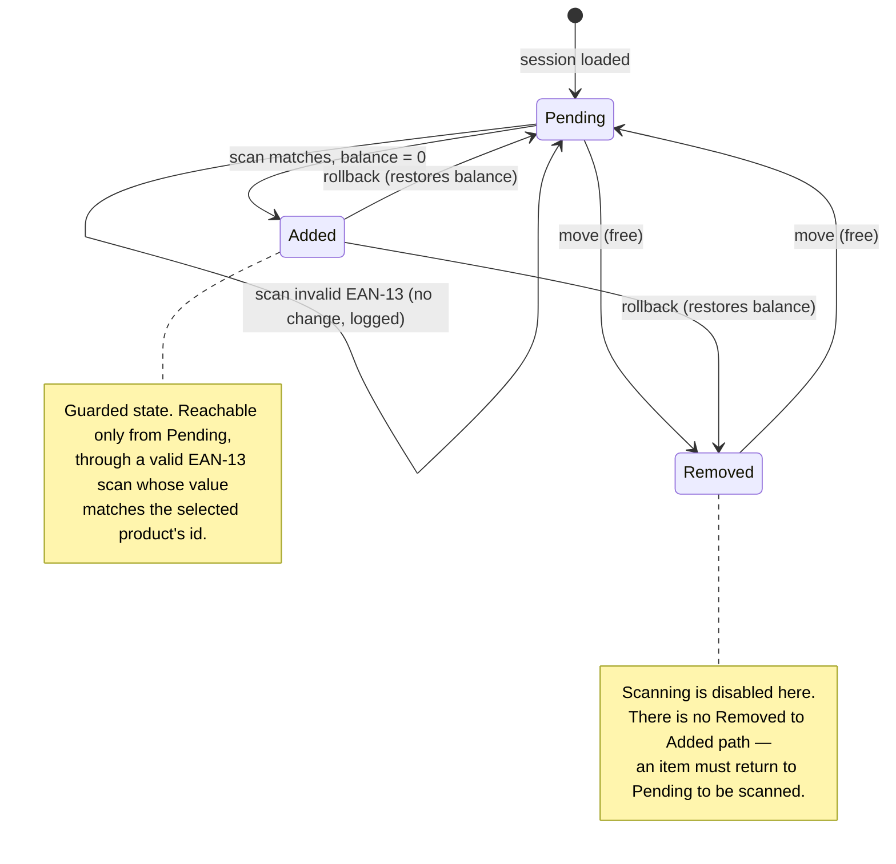

# Instapicker — Architectural Vision

> This document defines the design framework, data persistence strategy, and
> delivery timeline for the Instapicker application. It is the first commit on
> `main`.

---

## 1. The problem in one paragraph

A picker on a noisy warehouse floor works a **fluid picking session**: a list of
requested products, each of which lives in one of three states — **Pending**,
**Removed**, **Added**. Items flow freely between *Pending* and *Removed* as
shelf reality changes. Promoting an item to *Added* is a **guarded transition**:
it requires a live camera scan whose barcode must be a valid **EAN-13** *and*
must match the selected product's identifier. Every action is written to an
**append-only audit log**. The device will be interrupted constantly — calls,
low-memory kills — and the app must return the picker to the *exact* state,
active view, and progress with **no reload**.

This is not really a problem about feature count. The warehouse floor described
above demands **state predictability, resilience against process death, hardware
discipline, and deliberate engineering trade-offs** — every decision below is
chosen against those axes.

---

## 2. Guiding principles

1. **One source of truth, one direction of flow.** State is never mutated in
   place from the UI. User intents go in, a single deterministic function turns
   the current state into the next immutable one, and effects (persistence,
   camera, logging) are dispatched from one place. This is why the stack is
   **MVI**, not classic MVVM — on a warehouse floor an unpredictable state means
   a mis-pick, so the next state must be a repeatable function of what came
   before plus the action taken, never a side effect firing from some random
   corner of the UI.
2. **Persist first, remember nothing in RAM alone.** Every piece of session
   progress is written to the database the moment it changes, never left living
   only in memory that a phone call or a low-memory kill can evaporate. Because
   the durable copy is always up to date, coming back after an interruption is
   just "read the database" — there is no cache to replay and nothing to
   reconstruct.
3. **Take only the hardware you're using.** The camera and its image analysis are
   among the heaviest things a phone can run, so they are opened only inside the
   scanning surface, tied to its lifecycle, and released the instant they are no
   longer needed. No frames analysed in the background, no `ImageAnalysis`
   executors left running — the device works a full shift, and nothing should
   drain it that isn't actively being used.
4. **The audit log is sacred and append-only.** No updates, no deletes, ever. It
   is the forensic record and it is also, conveniently, a second corroborating
   source for reconstructing "what happened".

---

## 3. Tech Stack

| Concern | Choice | Why this |
|---|---|---|
| Language | **Kotlin** | Coroutines and Flow for concurrency, null-safety to avoid crashes — the standard for modern Android. |
| UI | **Jetpack Compose** | The screen is drawn from the state, which fits a one-way data flow directly. |
| Architecture | **MVI (Model-View-Intent)** | One-way state flow keeps every transition predictable and easy to test. |
| Async | **Coroutines + Flow / StateFlow** | Structured concurrency; the ViewModel exposes one `StateFlow<UiState>` that the UI observes. |
| DI | **Hilt** | Compile-time checked dependency graph; easy to swap fakes in tests. |
| Local persistence | **Room (SQLite)** | SQLite with transactions and Flow observation. State persists to disk, so progress survives if the system kills the app. Single source of truth for items and the audit log. |
| UI State restore | **SavedStateHandle** | Restores view state (active tab, and whether the scanner was open for an item) that doesn't belong in the database. |
| Barcode scanning | **CameraX + ML Kit Barcode Scanning** | CameraX manages the camera lifecycle correctly; ML Kit decodes EAN-13 on-device and offline, with no network needed on the floor. |
| Testing | **JUnit + MockK + Compose UI Test / Espresso** | State logic and the validator run as plain JVM unit tests; Compose tests cover the UI state boundaries. |
| Data provisioning | **Bundled JSON seed → Room on first launch** | Offline and deterministic. A fake `ProductSource` behind the repository interface lets us swap in a real API later without touching domain code. |

---

## 4. Module & layer structure

```
:app            → DI wiring, MainActivity, theme
:core:designsystem → Compose components, tokens
:core:database  → Room entities, DAOs, TypeConverters
:core:model     → pure Kotlin domain models (no Android imports)
:core:scanner   → reusable CameraX + ML Kit capability; decodes a barcode and
                  returns the raw string, with no picking/domain knowledge
:feature:picking
   ├─ domain    → PickingReducer, Ean13Validator
   ├─ data      → PickingRepository, ProductSource, AuditLogger
   └─ ui        → PickingViewModel, screens, UiState, Intents; consumes :core:scanner
```

Rationale: the **state logic and validators sit in `domain` with zero Android
dependencies**, so the core workflow logic is provable in millisecond-fast JVM
unit tests. Everything platform-specific (camera, Room, lifecycle) is pushed to
the edges.

---

## 5. State model — the heart of the app

### 5.1 Domain states



- **Pending ⇄ Removed**: free movement in either direction as shelf availability
  changes. Every move is logged.
- **Pending → Added (the only way in)**: guarded. Requires a live scan whose value
  (a) is a well-formed EAN-13, (b) passes the checksum, and (c) equals the selected
  product's `ean13`. For **stacked rows** (e.g. 3 identical milk cartons on one
  row), each valid matching scan **decrements the remaining balance**; the row
  flips to *Added* only when the balance reaches 0. A **Removed item cannot be
  scanned** — it has to be moved back to Pending first, which keeps the "was this
  actually on the shelf?" decision explicit and auditable.
- **Added → Pending/Removed (rollback)**: an added item can be sent back. Rolling
  back restores the full remaining balance and is logged as its own action.
- **Failed scans (mismatch or malformed)**: **no state change**. A soft,
  non-blocking notification tells the picker the code wasn't the expected one, and
  the failed attempt is written to the log as well — the log records *validation
  outcomes*, not just successes.

### 5.2 UI state

The whole screen is driven by one immutable snapshot, exposed as a single
`StateFlow<PickingUiState>` that the UI observes — nothing else is a source of
truth. Conceptually that snapshot holds the full list of session items (each with
its state and stack balance), the active tab, the scanner's current mode, and an
optional transient message for soft notifications.

The one shape worth pinning down is the **domain model**, because it's the data
contract the database, the UI, and the validation all map to:

```kotlin
data class PickItem(
    val id: String,
    val name: String,
    val ean13: String,
    val requestedQty: Int,
    val remainingToScan: Int,   // stack balance; must reach 0 before Added
    val state: PickState,       // PENDING | REMOVED | ADDED
)
```

> The exact `PickingUiState` shape (scanner sub-states, message plumbing) is
> illustrative — the code is the source of truth for precise signatures.

### 5.3 Intents (the only way to change anything)

```
LoadSession · MoveToPending · MoveToRemoved · StartScan(itemId) ·
BarcodeDetected(raw) · CancelScan · Rollback(itemId) · DismissMessage · ChangeTab
```

Each intent is turned into the next state by a single function that returns both
the new state and a list of effects to run — `(state, intent) -> (newState,
effects)`. That function does no I/O itself; the ViewModel carries out the effects
(persist, log, open camera). Keeping the transformation free of side effects is
what makes every state change deterministic and testable without a device.

---

## 6. Data persistence & resilience

The hardest requirement to get right is **session resilience**: surviving phone
calls and OS memory reclamation, then restoring the *exact* state with *no reload*.
The strategy is a **two-tier persistence split**:

**Tier 1 — Durable domain state (Room).** Every accepted intent that mutates
domain state writes through to Room inside a single transaction *before* the new
`UiState` is emitted. The `pick_items` table is the authoritative record of each
item's state and remaining balance. Because Room exposes the table as a `Flow`,
the ViewModel rebuilds `UiState` by *reading the database*, not by holding a
fragile in-memory cache. Process death loses nothing: on relaunch the ViewModel
re-collects the same Flow and the session materializes identically.

**Tier 2 — Active-view restore (SavedStateHandle).** Which tab is active, and
whether the full-screen scanner was open for a given item — these are UI concerns,
not domain facts, so they ride in `SavedStateHandle`, which Android restores across
system-initiated process death and configuration changes automatically. This is
what lets the app return the picker to their *exact active view*: if the scanner
was open for item X when a call came in, relaunching drops them straight back into
the scanner for item X — the camera re-bound fresh, the scan balance still intact
from Room. If the camera permission has been revoked on return, the scanner shows a
rationale instead of breaking — routing a permanent denial to system settings — and
the picker can cancel back to the item list. Keeping this out of the database also
keeps domain storage clean of UI noise.

**Why not just DataStore / a JSON blob?** A single serialized blob forces a full
rewrite on every mutation (write amplification, corruption risk on a killed
write) and can't be queried for the audit log. Room gives atomic per-row
transactions, relational integrity, and observability — the correct tool for a
session that mutates constantly under interruption.

### Persistence flow (write path)

```
Intent ─▶ state function ─▶ newState + effects
                                   │
                     ┌─────────────┼─────────────┐
                     ▼             ▼             ▼
              Room.transaction  AuditLog.append  SavedStateHandle
              (pick_items)      (append-only)    (tab/scanner view)
                     │
                     ▼
          Room Flow re-emits ─▶ ViewModel rebuilds UiState ─▶ Compose recomposes
```

---

## 7. Barcode validation — EAN-13

Decoding and validation are deliberately kept as separate concerns, split across
two modules:

1. **Decode** — handled by `:core:scanner` with ML Kit, restricted to
   `FORMAT_EAN_13` so the scanner isn't doing extra work decoding formats we never
   use. It knows nothing about products; it just returns the raw digits.
2. **Validate** — handled in the picking domain by a pure `Ean13Validator`:
   - exactly 13 digits, numeric only;
   - **checksum**: sum of odd-position digits + 3× even-position digits, the
     check digit must make the total a multiple of 10;
   - **identity**: decoded code `==` selected product's `ean13`.

Only all-three-pass promotes the scan; anything else → soft notification + logged
failure, no state change. Those log writes are insert-only — the audit DAO exposes
no update or delete, so the trail is append-only by construction. The validator
being pure means every branch (too short, non-numeric, bad checksum,
valid-but-mismatched) is a fast unit test.

---

## 8. Hardware efficiency

The camera is the most expensive thing this app touches, so every scanning decision
spends as little battery and CPU as possible.

- Camera bound to the **scanner composable's lifecycle** via CameraX; released the
  instant the full-screen scanner closes or the app backgrounds. No lingering `ImageAnalysis`.
- A **single-threaded analysis executor**, back-pressured with
  `STRATEGY_KEEP_ONLY_LATEST` so frames are dropped, not queued, under load.
- Scanning stops on first valid match; we don't keep analyzing frames after a hit.
- `LazyColumn` with **stable keys** and immutable item models to prevent needless
  recomposition of the (potentially long) picking list.
- **Camera permission is requested contextually** at the first scan, not on
  launch, with a short rationale. If it's denied, Pending ⇄ Removed picking keeps
  working; a permanent denial routes the picker to system settings rather than
  dead-ending the scan flow.

---

## 9. Testing

The core logic is verified where it's cheapest and most reliable — as plain JVM
unit tests. The state function is exercised across every legal and illegal
transition (Added only via a passing scan **from Pending**, mismatch never mutates
state, stacked balance decrements, rollback restores balance), and `Ean13Validator`
across checksum, length, and mismatch. A smaller set of Compose UI tests covers the
state boundaries the user can see (the scanner is the only way into Added; a soft
notification appears on mismatch). A lightweight CI job runs test + build + lint on
every push.

---

## 10. Delivery timeline (3 days)

**Day 0 (setup, ~2h)** — Private repo; `main` + `development` branches; push this
`ARCHITECTURE.md` as the first commit on `main`. Scaffold the project (single
module, package layout mirroring the target map), Hilt, Compose, Room, and CI
running test + build + lint on push.

**Day 1 — Skeleton & state core.** Domain models, `PickingReducer`, `Ean13Validator`
+ their full unit tests (TDD the pure core; integration/UI tests for the rest).
Room entities/DAOs, `PickingRepository`, JSON seed load. `PickingViewModel` wiring
`StateFlow<UiState>`. *Commit cadence:* one commit per cohesive unit
(models → PickingReducer+tests → persistence → viewmodel).

**Day 2 — UI & the guarded transition.** Three-tab Compose UI; free Pending⇄Removed
moves with logging; CameraX + ML Kit full-screen scanner; EAN-13 validation wired to
`BarcodeDetected`; stacked-counter decrement; Added transition; rollback; soft
mismatch notification. Audit log surfaced in a screen.

**Day 3 — Resilience, polish, package.** Process-death restoration verified
(SavedStateHandle + Room, including active-view restore), edge cases, remaining
tests green, `AGENTS.md`, `AI_LOG.md`, `README.md` reflective answers, 2-minute
demo video. Open PR `development → main`.

Building and testing the core logic first is deliberate: if time runs short, it is
the UI polish that slips, never the proven core.
